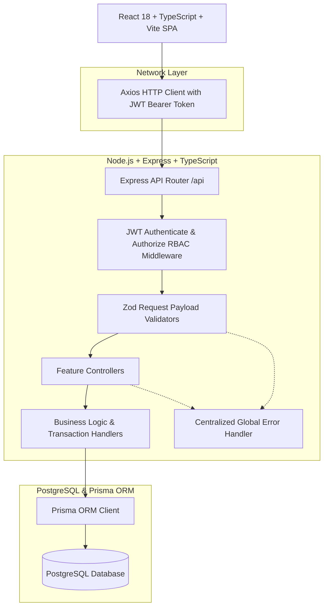
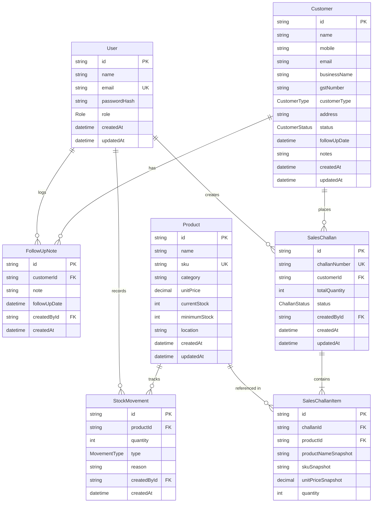
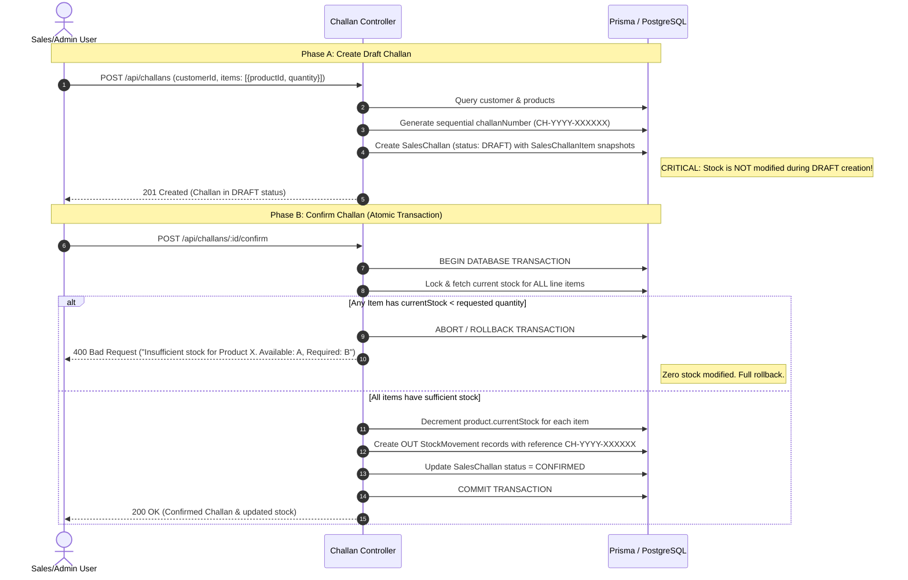

# Mini ERP + CRM Portal — System Architecture & Technical Design

This document details the high-level and component-level architecture, database schema, security model, and transactional business logic for the Mini ERP + CRM Operations Portal.

---

## 1. System Architecture Overview



---

## 2. Authentication & JWT Flow

1. **Client Submission**: Client sends user email and plaintext password over HTTPS to `POST /api/auth/login`.
2. **Password Verification**: Backend compares the submitted password against the stored bcrypt hash (`bcryptjs.compare`).
3. **Token Issuance**: Upon successful verification, a signed JSON Web Token (JWT) is issued containing the user payload:
   ```json
   {
     "userId": "uuid-v4",
     "email": "user@example.com",
     "role": "ADMIN | SALES | WAREHOUSE | ACCOUNTS",
     "name": "User Display Name",
     "exp": 1786524800
   }
   ```
4. **Header Interception**: Frontend stores the JWT and automatically attaches `Authorization: Bearer <token>` to every subsequent REST request via Axios request interceptors.
5. **Session Expiry & 401 Handling**: When a token expires, the backend returns `401 Unauthorized`. The Axios response interceptor immediately clears client storage and redirects the user to the `/login` portal.

---

## 3. Role-Based Access Control (RBAC) Matrix

Backend endpoints strictly enforce authorization rules via the `authorize(...roles)` middleware. The frontend role-based UI is used solely for UX convenience; backend security never trusts client input.

| Resource / Action | Endpoint | ADMIN | SALES | WAREHOUSE | ACCOUNTS |
| :--- | :--- | :---: | :---: | :---: | :---: |
| **Authentication & Health** | `GET /api/health`, `/api/auth/me` | ✅ | ✅ | ✅ | ✅ |
| **Dashboard Metrics** | `GET /api/dashboard/*` | ✅ | ✅ | ✅ | ✅ |
| **View Customers** | `GET /api/customers`, `/:id` | ✅ | ✅ | ✅ | ✅ |
| **Manage Customers** | `POST`, `PUT`, `DELETE /api/customers` | ✅ | ✅ | ❌ | ❌ |
| **Log CRM Follow-ups** | `POST /api/customers/:id/follow-ups` | ✅ | ✅ | ❌ | ❌ |
| **View Products** | `GET /api/products`, `/:id` | ✅ | ✅ | ✅ | ✅ |
| **Manage Products** | `POST`, `PUT`, `DELETE /api/products` | ✅ | ❌ | ✅ | ❌ |
| **View Inventory Movements**| `GET /api/stock-movements` | ✅ | ✅ | ✅ | ✅ |
| **Log Stock Adjustments** | `POST /api/stock-movements` | ✅ | ❌ | ✅ | ❌ |
| **View Sales Challans** | `GET /api/challans`, `/:id` | ✅ | ✅ | ✅ | ✅ |
| **Create / Confirm Challan**| `POST /api/challans`, `/:id/confirm` | ✅ | ✅ | ❌ | ❌ |
| **Cancel Draft Challan** | `POST /api/challans/:id/cancel` | ✅ | ✅ | ❌ | ❌ |

---

## 4. Entity Relationship Model & Database Schema



---

## 5. Sales Challan Lifecycle & Atomic Transaction Logic

The sales challan workflow represents the core operational integrity of the system.



### Safety Guarantees:
1. **Price Snapshots**: `SalesChallanItem` stores snapshot fields (`productNameSnapshot`, `skuSnapshot`, `unitPriceSnapshot`). If master catalog prices change later, past challans retain their historical values.
2. **Atomic Rollback**: If a challan has 10 line items and item 10 fails the stock check, items 1 through 9 are **not** decremented. The transaction is completely rolled back.
3. **No Direct Stock Manipulation**: Master product catalog updates cannot alter `currentStock`. Inventory stock changes can only occur through verifiable `StockMovement` records or confirmed `SalesChallan` transactions.
